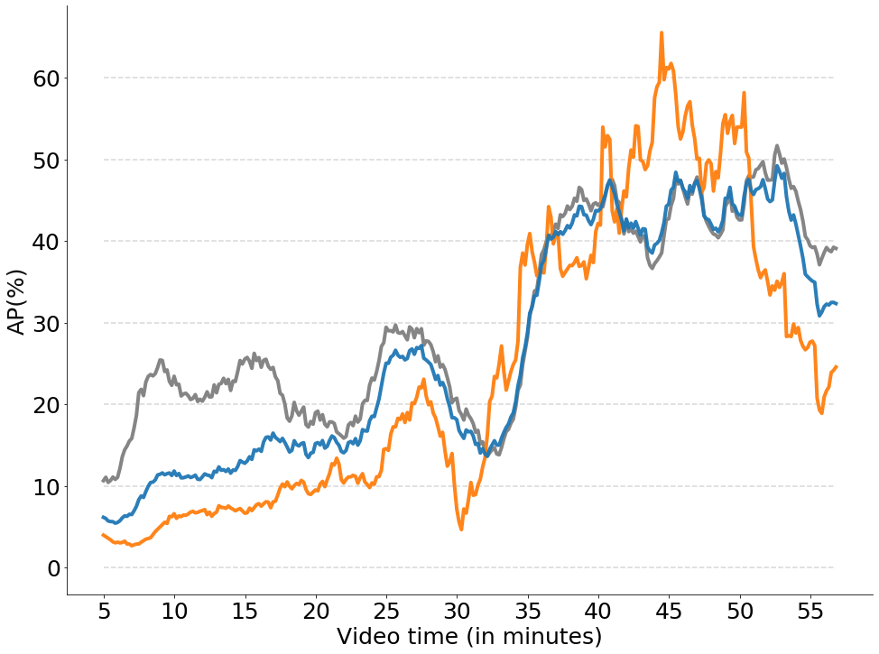

# Multimodal and multiview distillation for real-time player detection on a football field

This repository contains the code to reproduce the main results of the following paper: "Multimodal and multiview distillation for real-time player detection on a football field". The paper can be found here: [Paper](https://arxiv.org/abs/2004.07544). This work will be presented at the [6th International Workshop on Computer Vision in Sports (CVsports)](https://vap.aau.dk/cvsports/) at CVPR 2020.

```bibtex
@InProceedings{Cioppa2020Multimodal,
  author = {Cioppa, Anthony and Deliège, Adrien and Huda, Noor Ul and Gade, Rikke and Van Droogenbroeck, Marc and Moeslund, Thomas B.},
  title = {Multimodal and multiview distillation for real-time player detection on a football field},
  booktitle = {The IEEE Conference on Computer Vision and Pattern Recognition (CVPR) Workshops},
  month = {June},
  year = {2020}
}
```

The objective of this work is to monitor the occupancy of a football field using player detection on a thermal and a fisheye camera. In this work, we train a network in an online knowledge distillation approach as in our previous work [ARTHuS](http://openaccess.thecvf.com/content_CVPRW_2019/papers/CVSports/Cioppa_ARTHuS_Adaptive_Real-Time_Human_Segmentation_in_Sports_Through_Online_Distillation_CVPRW_2019_paper.pdf), [Github link](https://github.com/cioppaanthony/online-distillation). The main difference with our previous work is that the student and the teacher have different modalities and a different view of the same scene. In particular, we design a custom data augmentation combined with a motion detection algorithm to handle the training in the region of the fisheye camera not covered by the thermal one. We show that our solution is effective in detecting players on the whole field filmed by the fisheye camera.

<p align="center"></p>

This repository provides every module needed to reproduce the main results of the paper on our dataset: the network architecture, the losses, the training procedure and the evaluation.


## Getting Started

The following instructions will help you install the required libraries and the dataset to run the code. The code runs in <code>python 3</code> and was tested inside a nvidia-docker with the folowing base image: <code>pytorch:18.02-py3</code> which can be found at the following address: [NVIDIA TENSORFLOW IMAGE REPOSITORY](https://ngc.nvidia.com/catalog/containers/nvidia:pytorch/tags) and a conda environment.


### Prerequisites

Whether you are using the docker image or not, here are the versions of the libraries that are used:

```
h5py                   2.9.0       
matplotlib             3.0.3       
natsort                6.0.0       
numpy                  1.16.3      
opencv-python          4.1.0.25    
pandas                 0.22.0      
Pillow                 6.0.0       
scikit-image           0.15.0      
scikit-learn           0.20.3      
scipy                  1.0.1        
torch                  1.0.1.post2 
torchvision            0.2.2.post3 
tqdm                   4.23.1  
```

### Installing the libraries on docker

If you are using the nvidia-docker, you can follow these steps to instantiate the docker and install the libraries:


In our case we used the following commands to create the dockers. Note that you will need to replace */path/to/your/directory/* by the path to one of your directories and *path/to/the/docker/image* by the path to the docker image. Note that you can select the GPUs to use by changing the index(es) of the *NV_GPU* variable.

```
NV_GPU=0 nvidia-docker run --name Multimodal_Multiview_Distillation -it --rm --shm-size=1g --ulimit memlock=-1 -v /path/to/your/directory/:/workspace/generic path/to/the/docker/image nvcr.io/nvidia/pytorch:18.02-py3
```

To install the code and libraries, simply run:

```
1. git clone https://github.com/cioppaanthony/multimodal-multiview-distillation
3. cd multimodal-multiview-distillation
3. bash docker\_install.sh
```

At this step, all the required libraries are installed. Note that outside of a docker, sudo permission can be required to install the libraries in the <code>docker_install.sh</code> file.


### Installing the libraries with conda

If you are using conda, simply follow these steps to create the environment and install the required libraries:

```
conda create -n multimodal_multiview_distillation
conda install python=3.7 pip cudnn cudatoolkit=10.1
pip install numpy==1.16.3 tqdm==4.23.1 h5py==2.9.0 matplotlib==3.0.3 opencv-python-headless==4.1.0.25 opencv-contrib-python-headless==4.1.0.25 torch==1.0.1.post2 torchvision== 0.2.2.post3 natsort==6.0.0 pandas==0.22.0 Pillow==6.0.0 scikit-image==0.15.0 scikit-learn==0.20.3 scipy==1.0.1
```

### Installing the Dataset

The dataset needs to be installed in the data folder. We provide a script for automatically downloading the dataset from a Google Drive repository. The dataset is shared only for scientific research purposes. Please, see the [License](data/LICENSE.txt) file that comes along the dataset.

```
pip install -U pip setuptools
pip install gdown
sudo apt-get install zip

bash dataset_install.sh
```
The dataset contains:

* The fisheye video at 12 fps of the players on the field
* The thermal video re-sampled at 12 fps and temporally synchronized with the fishete video.
* A JSON file containing the bounding boxes of the teacher network, so on the thermal camera, which have been pre-computed by a Yolo network from a [previous work](https://www.mdpi.com/1424-8220/20/7/1982).
* The pre-computed ViBe masks (the background subtraction algorithm) on the fisheye video in image format. These masks have been obtained with our Pytorch implementation of ViBe which will be shared this summer on our GitHub as well.
* The field and calibration masks.

## Training the network

The code for the online distillation is located inside the <code>performance_benchmark</code> folder under the name <code>main.py</code>.

To run the code, simply go to the <code>performance_benchmark</code> folder and run the following command:

```
cd performance_benchmark
python3 main.py
```

This code will save in the <code>output</code> folder. At each run of the code it will create an <code>experiment_i</code> folder containing three sub-fodlers:
1. A JSON file containing the output bounding boxes of the student network on the fisheye camera in the <code>student_outputs</code> folder.
2. The last weights of the network during the online distillation in the <code>networks</code> folder.
3. If requested by the <code>--outteacher 1</code> argument, it will save the output of the teacher network on the fisheye and thermal images in the <code>teacher_output</code> folder.

Note that a lot of different arguments are also available for this command line in the <code>utils/argument\_parser.py</code> file to control the training.

The detections are stored in the json format and must be used in the following command line to apply the background subtraction post-processing and get the final video with the detected players overlayed.

## Getting the video with the detections

To apply the background subtraction post-processing on the results and get the final output video containing the bounding boxes, you will need to run the folowing command line also from the <code>performance_benchmark</code>:

```
python3 bgs_postprocessing.py --fisheyebbox path/to/the/json/detection/file -s /path/to/save/results/
```

This code also saves the final bounding boxes for the evaluation in the <code>detections_with_BGS.json</code> file. By default, it is saved in the <code>output</code> folder.


## Getting the performance graph

Finally, we provide a way to compute the same graphs of our paper (Figure 8) evaluating the quality of the detected players during the online distillation phase post-processed by the background subtraction algorithm. By default, the graph is saved in the output folder.

```
python3 evaluate.py --fisheyebbox path/to/the/json/detection/file/detections_with_bgs.json -s /path/to/save/the/graph/
```

<p align="center"></p>


## Authors

* **Anthony Cioppa**, University of Liège (ULiège).
* **Adrien Deliège**, University of Liège (ULiège).
* **Noor Ul Huda**, Aalborg University (AAU).

See the [AUTHORS](AUTHORS) file for details.


## License

GNU GENERAL PUBLIC LICENSE Version 3

See the [LICENSE](LICENSE) file for details.

## Acknowledgments

* Anthony Cioppa is funded by the FRIA, Belgium.
* This work is supported by the DeepSport project of the Walloon Region, at the University of Liège (ULiège), Belgium.
* Many thanks to Aalborg University and all the staff of the Visual Analysis of People Laboratory for their warm welcome during this research stay.
